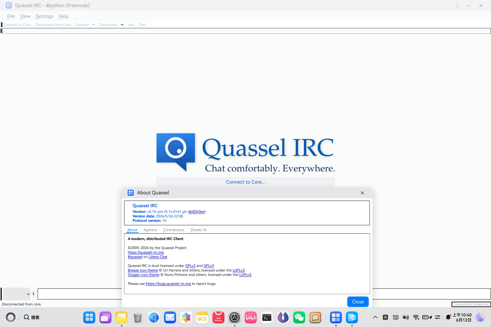

<h1 align="center">
Quassel for HarmonyOS
</h1>

<div align="center">
<picture>
    
</picture>
</div>

## 目录

- [目录](#目录)
- [项目简介](#项目简介)
- [仓库结构](#仓库结构)
- [环境要求](#环境要求)
- [快速开始](#快速开始)
  - [1. 克隆代码库](#1-克隆代码库)
  - [2. 交叉编译构建流程](#2-交叉编译构建流程)
  - [3. 生成签名并推送](#3-生成签名并推送)
- [致谢](#致谢)
- [License](#license)

## 项目简介

本项目旨在将知名的跨平台分布式 IRC 客户端 [Quassel](https://github.com/quassel/quassel) 以及其核心依赖项移植到 OpenHarmony 平台。

## 仓库结构

```text
.
├── scripts/                    # 自动化构建脚本目录
│   ├── common/                 # 共有工具脚本
│   ├── qt/                     # Qt 源码下载、宿主机及目标机交叉编译脚本
│   └── quassel/                # Quassel 主程序交叉编译脚本
├── third_party/                # 第三方依赖及子模块
│   ├── lycium/                 # 用于 OpenHarmony 的第三方库交叉编译框架
│   └── quassel/                # Quassel 源码 (Git Submodule)
├── LICENSE                     # MIT 开源许可证
└── .gitmodules                 # 子模块配置
```

## 环境要求

在编译本工程前，请确保开发环境满足以下要求：

* **操作系统**: Linux/WSL2 环境 (推荐 Ubuntu 20.04/22.04)
* **OpenHarmony SDK**: 已下载并解压 OpenHarmony SDK
* **基础工具链**: 
  
  ```bash
  sudo apt update
  sudo apt install -y \
       build-essential autoconf automake libtool pkg-config \
       bison flex perl python3 curl wget tar xz-utils
  ```

* **IDE**: [DevEco Studio](https://developer.huawei.com/consumer/cn/deveco-studio/) (生成签名)、VSCode

**环境变量配置**:
必须在您的 `.bashrc` 或构建终端中配置 `TOOL_HOME` 环境变量以指向 SDK 根目录。脚本会默认根据 `$TOOL_HOME/sdk/default/openharmony/native` 寻找 NATIVE SDK。

```bash
export TOOL_HOME="~/software/command-line-tools"
```

## 快速开始

### 1. 克隆代码库

本项目使用了 Git Submodules 管理源码依赖：

```bash
git clone --recursive https://github.com/baitianyu-kun/makeQuassel.git
cd makeQuassel
```

### 2. 交叉编译构建流程

在确保环境变量 `TOOL_HOME` 配置无误后，请**依次**执行以下脚本：

```bash
# 第一步：下载并编译 Qt for HarmonyOS
cd ./scripts/qt
./download_qt.sh
./build_qt_host.sh
./build_qt.sh

# 第二步：编译 Quassel 相关依赖库 (boost)
cd ./third_party/lycium
./build_all_packages.sh

# 第三步：编译 Quassel
cd ./scripts/quassel
./build_quassel.sh

# 第四步：打包与构建 HAP
cd ./scripts/common
./generate_deployment_settings.sh
./generate_hvigor_hap.sh
```

### 3. 生成签名并推送

* 在 DevEco Studio 中打开 libquasselclient-harmonyos ，并进行签名和构建

## 致谢

- [lycium](https://gitee.com/openharmony-sig/tpc_c_cplusplus)
- [Quassel](https://github.com/quassel/quassel)
- claude、gemini、deepseek-v4

## License

本项目使用 **MIT License**。详情请参阅 [LICENSE](./LICENSE) 文件。